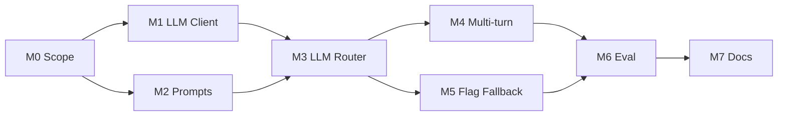

# Plan: LLM-Based Orchestrator & Multi-Turn Conversation

**Context:** The basic skeleton (keyword-based orchestrator, agents, tools, UI) is in place per [Plan.md](Plan.md). This plan adds an **LLM-based orchestrator** and strengthens **multi-turn conversation** (reference resolution, context recall) while keeping agents and tools unchanged.

**Goal:** Replace or augment the keyword intent/router with an LLM that (1) classifies intent and slots from conversation context, (2) resolves references like "that" / "the order", and (3) optionally generates clarification messages—so users can have natural multi-turn conversations.

---

## Milestone 0 — LLM Orchestrator Scope & Contracts

**Status:** Done  
**Owner:** Lead

### Tasks

* [x] Define what the LLM decides (intent, order_id, clarification vs proceed)
* [x] Define LLM input: conversation history + current message + extracted_entities
* [x] Define LLM output schema (structured JSON: intent, order_id?, clarification_message?, proceed?)
* [x] Define fallback: when LLM fails or times out, use keyword orchestrator
* [x] Document multi-turn context flow: state → LLM → routing → agent

### Artifacts

* `docs/LLM_ORCHESTRATOR_DESIGN.md`
* `/schemas/llm_orchestrator_output.json`

### Acceptance Criteria

* Clear boundary: LLM only decides intent/slots/clarification; agents and tools unchanged
* Structured output only; no free-form routing
* Fallback strategy documented

---

## Milestone 1 — LLM Client & Config

**Status:** Done  
**Owner:** Agent A

### Tasks

* [x] Add LLM client (OpenAI API or compatible)
* [x] Config: API key (env), model name, max_tokens, temperature
* [x] Wrapper: `call_orchestrator_llm(messages, context)` with mock when no key
* [ ] Optional: support for Azure OpenAI / other providers

### Artifacts

```
/orchestrator
  llm_client.py   # or shared llm/ module
```

* `requirements.txt`: openai (or equivalent)
* `.env.example`: OPENAI_API_KEY, OPENAI_MODEL (default gpt-3.5-turbo)

### Acceptance Criteria

* LLM calls are configurable and timeout-safe
* No API key in code; env only

---

## Milestone 2 — Prompt Design for Orchestrator

**Status:** Done  
**Owner:** Agent B

### Tasks

* [x] System prompt: role (orchestrator), allowed intents (cancel, track, product, unclear), slot (order_id), output format
* [x] User prompt: last N turns + current message + extracted_entities (Known context:)
* [x] Instructions for reference resolution: "that" / "it" / "the order" → order_id from context
* [x] Instructions for clarification: when to ask for order_id vs when to proceed
* [x] Structured output: JSON with intent, order_id (optional), clarification_message (optional), proceed (bool)

### Artifacts

* `orchestrator/prompts.py` (or `orchestrator/prompts/`) with system + user template
* Document prompt in README or docs

### Acceptance Criteria

* Prompt produces valid JSON matching schema
* Multi-turn example in prompt or few-shot

---

## Milestone 3 — LLM-Based Intent, Slots & Routing

**Status:** Done  
**Owner:** Agent C

### Tasks

* [x] New module: `orchestrator/llm_router.py`
* [x] Build LLM input from ConversationState (turns, extracted_entities) + current message
* [x] Call LLM (or mock); parse structured output (intent, order_id?, clarification_message?, proceed?)
* [x] Validate LLM output: intent in enum, order_id matches ORD-\d+ if present
* [x] If proceed and slots valid: route to agent (reuse existing router + _invoke_agent)
* [x] If clarification: return clarification_message and persist state (no agent call)
* [x] Trace: orchestrator_type "llm" | "keyword" in trace event

### Artifacts

```
/orchestrator
  llm_router.py      # or llm_decision_engine.py
  prompts.py
```

### Acceptance Criteria

* Orchestrator can run in "LLM mode" when configured
* Keyword path remains available (feature flag or config)
* All decisions still traceable (intent, slots, clarification vs proceed)

---

## Milestone 4 — Multi-Turn Context in LLM

**Status:** Done  
**Owner:** Agent D

### Tasks

* [x] Pass last K turns (MAX_TURNS_IN_CONTEXT=10) to LLM with user/assistant labels
* [x] Pass extracted_entities (order_id, product) into prompt as "Known context:"
* [x] Mock and LLM resolve "that" from context (last_order_id / Known context)
* [x] Multi-turn: Turn 1 cancel ORD-4567, Turn 2 "cancel that" → same order from context
* [x] Update state: set state.extracted_entities["order_id"] from LLM output when proceed

### Artifacts

* Updated prompts and llm_router to include full multi-turn context
* Optional: `orchestrator/context_builder.py` (format conversation for LLM)

### Acceptance Criteria

* Multi-turn reference resolution works for "that" / "the order" / "it"
* Conversation history is bounded (token limit) and serialized clearly

---

## Milestone 5 — Feature Flag & Fallback

**Status:** Done  
**Owner:** Agent E

### Tasks

* [x] Config/env: USE_LLM_ORCHESTRATOR (default false for safety)
* [x] When true: use LLM for intent/slots/clarification; when false: use keyword orchestrator
* [x] On LLM failure (exception): fallback to keyword path
* [x] Trace event includes orchestrator_type: "llm" | "keyword"

### Artifacts

* Env and config in main/decision_engine
* Fallback logic in llm_router or decision_engine

### Acceptance Criteria

* One config switch toggles LLM vs keyword
* No silent failures; fallback is logged and traceable

---

## Milestone 6 — Evaluation & Guardrails

**Status:** Done  
**Owner:** Agent F

### Tasks

* [x] Test suite: tests/e2e/test_llm_orchestrator.py (multi-turn, cancel/track/product, clarification, trace)
* [x] Guardrails: validate LLM output in llm_router (intent enum, order_id format); force clarification if invalid
* [ ] Optional: cost/latency logging per request (tokens, model, ms)
* [x] Document: guardrails and when to use LLM vs keyword in docs/LLM_ORCHESTRATOR_DESIGN.md

### Artifacts

* `tests/e2e/test_llm_orchestrator.py` or extend existing e2e
* Docs: guardrails and validation rules

### Acceptance Criteria

* LLM output is never trusted blindly; validation before routing
* Multi-turn tests pass with LLM orchestrator enabled

---

## Milestone 7 — Documentation & Run Instructions

**Status:** Done  
**Owner:** Agent G

### Tasks

* [x] README: LLM-based orchestrator section (env), link to docs, tests instruction
* [x] docs/MULTI_TURN_AND_LLM.md: multi-turn and state management with LLM
* [x] docs/LLM_ORCHESTRATOR_DESIGN.md: scope, fallback, guardrails

### Artifacts

* README section "LLM-based orchestrator"
* Optional: docs/MULTI_TURN_AND_LLM.md

### Acceptance Criteria

* New contributor can enable LLM and run multi-turn flows from README

---

## Critical Path Summary

**Blocking:**  
M0 → M1 → M2 → M3 → M4  
M5 (feature flag) can run in parallel with M4.  
M6, M7 after M4/M5.

**Dependencies:**



---

## Out of Scope (This Plan)

* Replacing agents with LLM (agents stay deterministic and tool-calling)
* RAG for product info (current knowledge base remains; can be extended later)
* Fine-tuning; we use prompting and structured output only
