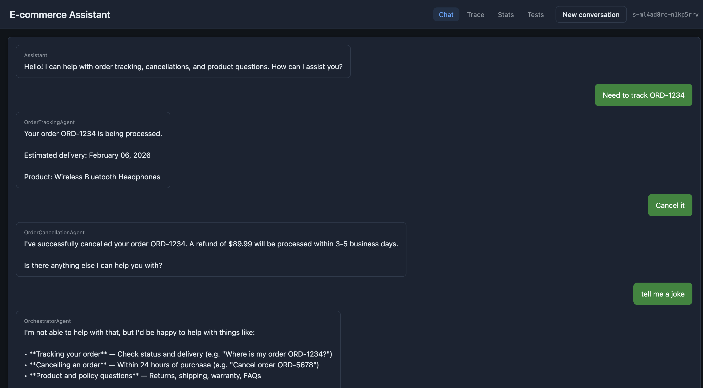
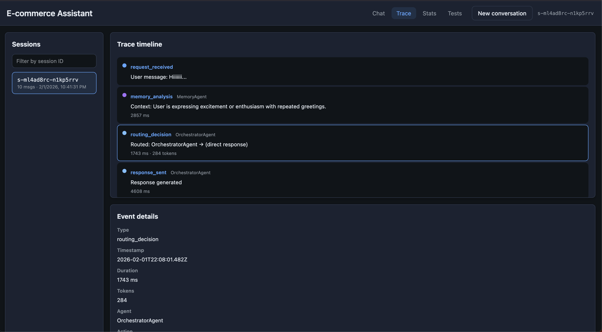
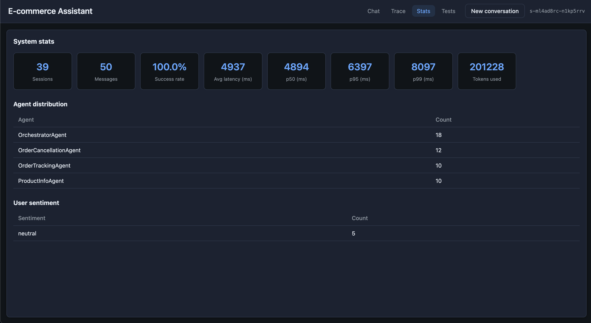
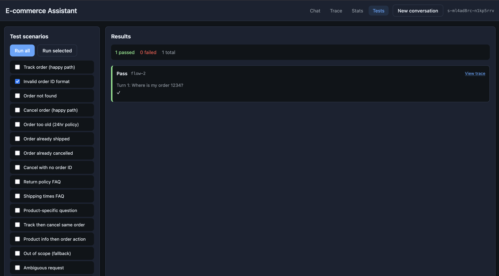
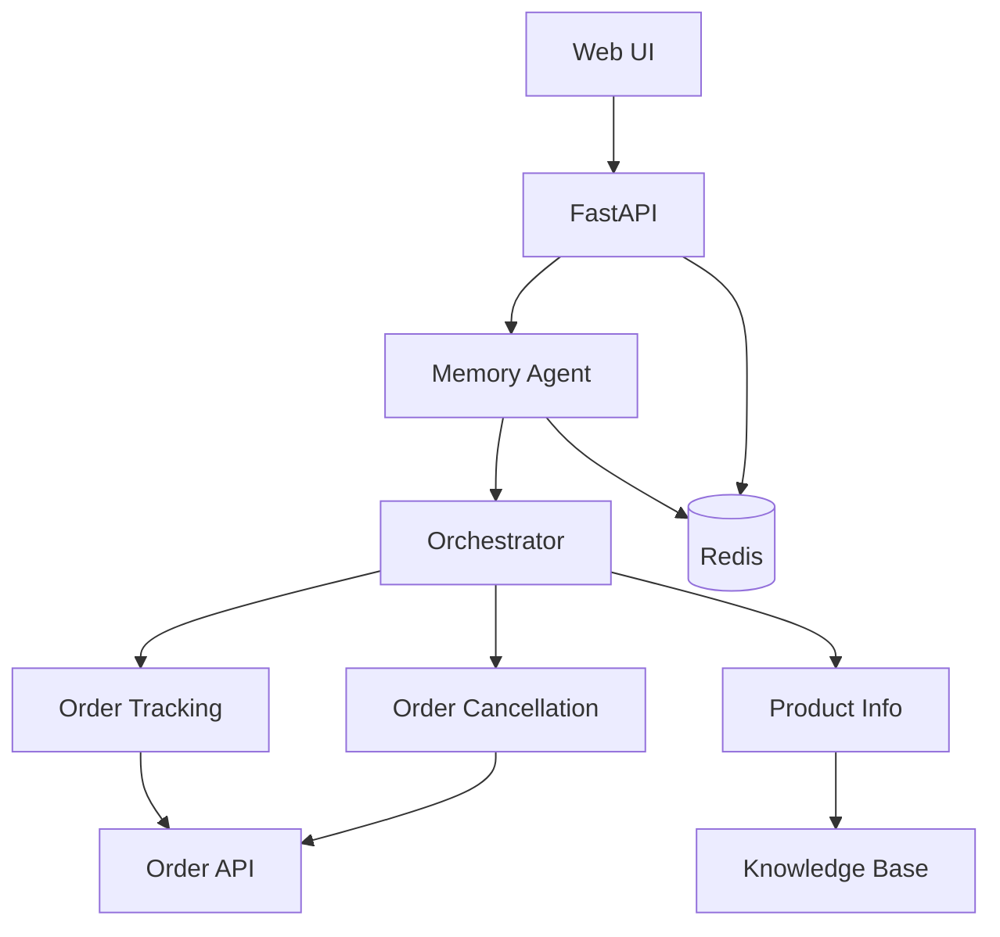

# E-commerce Multi-Agent Customer Service System

A production-ready multi-agent chatbot for e-commerce support: order tracking, cancellation, and product FAQs. Built with **FastAPI**, **Redis**, **OpenAI**, and a **vanilla JS** UI.

## Quick Start (30 seconds)

```bash
cp .env.example .env        # Add your OPENAI_API_KEY
docker-compose up -d        # Start app + Redis
open http://localhost:8000  # Chat UI
```

---

## Screenshots

| Chat | Trace |
|------|-------|
|  |  |

| Stats | Tests |
|-------|-------|
|  |  |

---

## Key Features

| Feature | Implementation |
|---------|----------------|
| **Multi-agent routing** | LLM-based intent detection with confidence scoring; routes to specialist agents |
| **Multi-turn memory** | Session state in Redis; resolves "that order" / "those headphones" across turns |
| **Sentiment & urgency** | Memory Agent detects frustration/escalation and adjusts routing |
| **Tool calls** | Agents call Order API and Knowledge Base; results traced per request |
| **Observability** | Full trace timeline, latency stats, token usage, agent distribution |
| **Golden tests** | Run automated scenarios from UI; link to trace for debugging |

---

## Architecture

```
User → API → Memory Agent → Orchestrator → Specialist Agent → Response
                ↓                              ↓
              Redis                        Tools (Order API, KB)
```



**Request flow:**
1. **Memory Agent** – Loads session, resolves references ("that order" → ORD-1234), detects sentiment
2. **Orchestrator** – LLM classifies intent → routes to the right agent
3. **Specialist Agent** – Calls tools (Order API, KB), returns structured response
4. **Persist** – Session + trace saved to Redis with TTL

---

## Design Decisions

| Decision | Why |
|----------|-----|
| **LLM routing (not keyword)** | Handles paraphrasing ("where's my stuff?" = "track order"), multi-intent, and ambiguous prompts with confidence scores |
| **Redis for state** | TTL, horizontal scaling, shared store for sessions + traces + stats. App stays stateless. |
| **Memory Agent before routing** | Resolves pronouns ("cancel that order") and enriches context before intent classification |
| **Vanilla JS UI** | No build step, no framework lock-in. Easy to hand off or swap. |
| **Structured tool calls** | Every agent call logs tool name, input, output, duration, success/error for tracing |

---

## Project Structure

```
├── agents/                 # Specialist agents (tracking, cancellation, product, memory)
│   ├── base.py             # BaseAgent class with response validation
│   ├── memory.py           # Context resolution, sentiment, reference handling
│   ├── order_tracking.py   # Track order status
│   ├── order_cancellation.py # Cancel with 24h policy
│   └── product_info.py     # FAQ + knowledge base lookup
├── orchestrator/
│   ├── router.py           # LLM intent routing with confidence threshold
│   └── llm_client.py       # OpenAI client with structured output
├── tools/
│   ├── order_api.py        # Mock order API (get, cancel)
│   └── knowledge_base.py   # FAQ search (returns, shipping, warranty)
├── memory/
│   └── redis_store.py      # Session persistence with TTL
├── observability/
│   ├── tracer.py           # Event tracing (stored in Redis)
│   ├── stats.py            # Aggregate metrics
│   └── logger.py           # Structured JSON logging
├── schemas/                # Pydantic models (session, agent response, trace)
├── testing/
│   ├── store.py            # Test scenario storage
│   └── runner.py           # Run tests against /chat endpoint
├── tests/golden/           # Golden test scenarios (JSON)
├── ui/                     # Vanilla JS frontend (Chat, Trace, Stats, Tests)
└── src/main.py             # FastAPI app, endpoints, lifespan
```

---

## Multi-turn Conversation & State

Session state is keyed by `session_id` and stored in Redis:

- **`conversation_history`** – All turns (user + assistant messages, which agent replied)
- **`extracted_entities`** – Order IDs, products, issues mentioned (for reference resolution)

**How "Cancel that order" works:**
1. User: "Track ORD-1234" → OrderTrackingAgent responds, session stores `order_ids: ["ORD-1234"]`
2. User: "Cancel that order" → Memory Agent resolves "that order" → ORD-1234
3. Orchestrator routes to OrderCancellationAgent with resolved message

See `schemas/session.py` for `SessionState`, `ConversationTurn`, `ExtractedEntities`.

---

## API

| Method | Path | Description |
|--------|------|-------------|
| POST | `/chat` | Send message, get response. Body: `{"session_id": "...", "message": "..."}` |
| GET | `/health` | Health check (app + Redis) |
| GET | `/sessions` | List sessions |
| GET | `/sessions/{id}/trace` | Full trace for a session |
| GET | `/stats` | Aggregate stats |
| POST | `/tests/run-all` | Run golden tests |

**Response shape:**
```json
{
  "session_id": "demo-1",
  "response": "Your order ORD-1234 has been shipped...",
  "agent": "OrderTrackingAgent",
  "tool_calls": [
    {"tool": "OrderAPI.get_order", "input": {"order_id": "ORD-1234"}, "duration_ms": 5, "success": true}
  ],
  "handover": "MemoryAgent → OrchestratorAgent → OrderTrackingAgent",
  "confidence": 0.95
}
```

---

## UI Tabs

| Tab | Purpose |
|-----|---------|
| **Chat** | Send messages; session persists in browser |
| **Trace** | Select session → see timeline (memory → routing → agent → tools) |
| **Stats** | Sessions, messages, latency p50/p95/p99, tokens, agent distribution |
| **Tests** | Run all/selected golden tests; click "View trace" on failures |

---

## Running Tests

From the UI: click **Tests** tab → **Run all**.

Or via API:
```bash
curl -s -X POST http://localhost:8000/tests/run-all | jq '.results[] | {test_id, passed}'
```

Golden tests are in `tests/golden/flows.json` and cover:
- Order tracking (valid ID, invalid format, not found)
- Cancellation (eligible, 24h policy, shipped, already cancelled)
- Product FAQs
- Multi-turn reference resolution
- Out-of-scope fallback

---

## Demo Scenarios

```bash
# Health
curl -s http://localhost:8000/health | jq .

# Track order
curl -s -X POST http://localhost:8000/chat -H "Content-Type: application/json" \
  -d '{"session_id": "demo", "message": "Track my order ORD-1234"}' | jq '.response, .agent'

# Cancel (eligible)
curl -s -X POST http://localhost:8000/chat -H "Content-Type: application/json" \
  -d '{"session_id": "demo", "message": "Cancel order ORD-6789"}' | jq '.response, .agent'

# Multi-turn: "that order"
curl -s -X POST http://localhost:8000/chat -H "Content-Type: application/json" \
  -d '{"session_id": "demo", "message": "What is the status of ORD-1234?"}' | jq '.response'
curl -s -X POST http://localhost:8000/chat -H "Content-Type: application/json" \
  -d '{"session_id": "demo", "message": "Cancel that order"}' | jq '.response, .agent'

# FAQ
curl -s -X POST http://localhost:8000/chat -H "Content-Type: application/json" \
  -d '{"session_id": "demo", "message": "What is your return policy?"}' | jq '.response'

# Out of scope (gently guides user)
curl -s -X POST http://localhost:8000/chat -H "Content-Type: application/json" \
  -d '{"session_id": "demo", "message": "What is the weather?"}' | jq '.response'
```

Or run the demo script: `./scripts/demo.sh`

---

## Extending

**Add a new agent:**
1. Create `agents/my_agent.py`, subclass `BaseAgent`, implement `process(session, message)` → `AgentResponse`
2. Register: `orchestrator.register_agent("my_intent", my_agent)` in `src/main.py`
3. Update prompt in `orchestrator/router.py` with new intent + examples

**Add a new tool:**
1. Add module under `tools/` (e.g., `tools/inventory.py`)
2. Inject into agent's `__init__`, call from `process()`

---

## Production Notes

- **Secrets:** `OPENAI_API_KEY` in env or secret manager; `.env` is gitignored
- **Redis:** Use managed Redis with TLS in production
- **Scaling:** App is stateless; scale horizontally behind a load balancer
- **Observability:** JSON logs with correlation IDs; `/stats` + `/sessions/{id}/trace` for debugging
- **Rate limits:** Add backoff in `orchestrator/llm_client.py` for OpenAI limits

---

## Tech Stack

- **Python 3.11+** / FastAPI / Pydantic
- **Redis** (sessions, traces, stats)
- **OpenAI** (GPT-4o-mini for routing + memory analysis)
- **Docker Compose** (app + Redis)
- **Vanilla JS** (no build step)

---

## License

MIT
