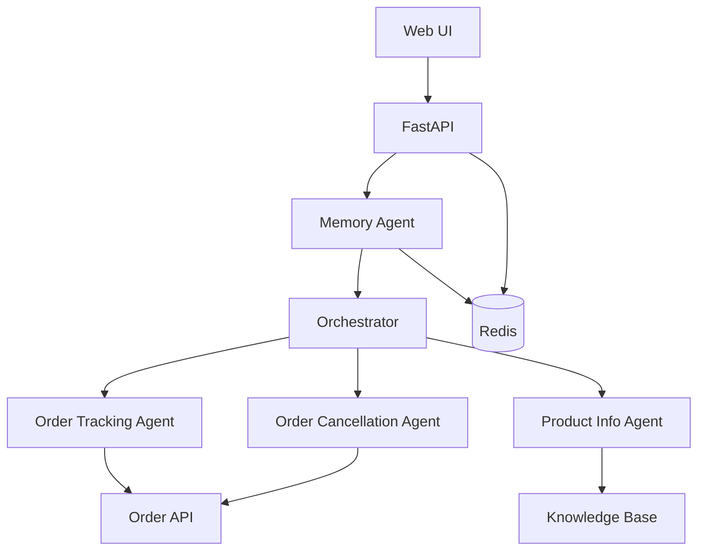

# E-commerce Multi-Agent Assistant

A multi-agent customer service system for e-commerce: order tracking, cancellation (24-hour policy), and product/FAQ answers. Each request is analyzed by an LLM-enhanced Memory Agent, routed by an Orchestrator to the right specialist agent, and state is persisted in Redis for multi-turn conversations.

The stack is **FastAPI** (Python), **Redis** (sessions + traces + stats), **OpenAI** (routing + memory analysis), and a **vanilla JS** web UI (Chat, Trace, Stats, Tests). No frontend build step.

---

## Architecture



**Pipeline:** User message → Memory Agent (context, references, sentiment) → Orchestrator (intent) → Specialist agent → Response. Session and trace data are stored in Redis.

---

## Design Decisions

| Decision | Rationale |
|----------|-----------|
| **Redis for state** | Sessions, traces, and stats need a shared store that supports TTL, listing, and horizontal scaling. Redis is standard for this and keeps the app stateless. |
| **LLM routing vs keyword** | Keyword routing is brittle for paraphrasing and multi-intent. A small LLM call for intent + confidence gives better UX and handles "track my order ORD-1234" vs "where's my stuff?" and ambiguous prompts. |
| **Vanilla JS for UI** | No build step, no framework lock-in, and the UI (Chat, Trace, Stats, Tests) stays simple. Easy to hand off or modify. |

---

## Multi-turn and state management

Conversational state is keyed by **`session_id`** and stored in **Redis** (see `memory/redis_store.py`). Each session holds:

- **`conversation_history`** – List of turns (user/assistant messages and which agent replied).
- **`extracted_entities`** – Order IDs, products, and issues mentioned so far (e.g. for resolving “that order” or “those headphones”).

**Flow per request:**

1. **Load or create session** – GET session by `session_id` from Redis; if missing, create a new `SessionState`.
2. **Append user message** – Add the current message to `conversation_history`.
3. **Memory Agent** – Reads full history and `extracted_entities`, resolves references (“that order” → last order_id, “those” → last product), detects sentiment/urgency, and returns a context summary and resolved message.
4. **Orchestrator** – Uses the Memory context and the (optionally resolved) message to choose intent and route to the right agent.
5. **Specialist agent** – Runs with the resolved message and session; may call tools (Order API, Knowledge Base) and update `extracted_entities` (e.g. new order_id).
6. **Save session** – Append assistant response to `conversation_history`, write updated `SessionState` (and entities) back to Redis with TTL.

So multi-turn and state are handled **between** agents by: (1) a single shared `SessionState` in Redis keyed by `session_id`, (2) the Memory Agent resolving references and enriching context before routing, and (3) agents reading/writing `conversation_history` and `extracted_entities` on that session. See `schemas/session.py` for `SessionState`, `ConversationTurn`, and `ExtractedEntities`.

---

## Prerequisites

- **Docker** and **Docker Compose**
- **OpenAI API key** (for routing and Memory Agent)

---

## Setup

1. **Clone and enter the repo**
   ```bash
   cd zendesk
   ```

2. **Configure environment**
   ```bash
   cp .env.example .env
   ```
   Edit `.env` and set:
   - `OPENAI_API_KEY` (required)
   - `OPENAI_MODEL` (default: `gpt-4o-mini`)
   - `REDIS_URL` (default: `redis://redis:6379` for Docker)

3. **Run with Docker Compose**
   ```bash
   docker-compose up -d
   ```
   This starts the app and Redis. The app listens on port **8000**.

4. **Verify**
   ```bash
   curl -s http://localhost:8000/health
   ```
   Expected: `{"status":"healthy","redis":"connected","version":"1.0.0"}`

5. **Open the UI**
   - Chat: http://localhost:8000/
   - API docs (Swagger): http://localhost:8000/docs

---

## API Overview

| Method | Path | Description |
|--------|------|-------------|
| GET | `/health` | Health check (app + Redis). |
| POST | `/chat` | Send a message; returns assistant response. Body: `{"session_id": "...", "message": "..."}`. |
| GET | `/sessions` | List recent sessions (`?limit=100`). |
| GET | `/sessions/{id}` | Session details + full trace. |
| GET | `/sessions/{id}/trace` | Trace events only. |
| GET | `/stats` | Aggregate stats (sessions, messages, success rate, latency, tokens, agents). |
| GET | `/tests` | List test scenarios. |
| POST | `/tests/{id}/run` | Run one test. |
| POST | `/tests/run-all` | Run all (or subset). Body (optional): `{"test_ids": ["id1", "id2"]}`. |

### Structured output (JSON) schemas

**Chat request (POST /chat):**

```json
{
  "session_id": "string",
  "message": "string"
}
```

**Chat response:**

```json
{
  "session_id": "string",
  "response": "string",
  "agent": "string",
  "tool_calls": [
    {
      "tool": "string",
      "input": { "order_id": "ORD-1234" },
      "result": { "status": "cancelled", "refund_amount": 59.99 },
      "duration_ms": 12,
      "success": true,
      "error": null
    }
  ],
  "handover": "MemoryAgent → OrchestratorAgent → OrderCancellationAgent",
  "confidence": 0.95,
  "metadata": {}
}
```

**ToolCall** (each entry in `tool_calls`): `tool` (name of the tool, e.g. `OrderAPI.cancel_order`), `input` (parameters sent), `result` (tool output or null), `duration_ms`, `success`, `error` (message if failed). Agents return a single **AgentResponse** (response text, agent name, tool_calls, handover, confidence, metadata); the API wraps it as the Chat response above.

### Example: Chat

```bash
curl -s -X POST http://localhost:8000/chat \
  -H "Content-Type: application/json" \
  -d '{"session_id": "demo-1", "message": "Track my order ORD-1234"}' | jq .
```

### Example: Health

```bash
curl -s http://localhost:8000/health
```

### Example: Stats

```bash
curl -s http://localhost:8000/stats
```

---

## UI

- **Chat** – Send messages; session is kept by `session_id` (stored in browser).
- **Trace** – Pick a session, see timeline of events (memory → routing → agent → tools), click an event for details.
- **Stats** – Sessions, messages, success rate, latency percentiles, tokens, agent distribution (refreshes every 30s on that tab).
- **Tests** – Run all or selected golden scenarios; view pass/fail and open the trace for a run.

---

## How to Extend

### Add a new agent

1. Create `agents/my_agent.py`: subclass `BaseAgent`, implement `process(session, message)` and return an `AgentResponse`.
2. Register in `src/main.py`: instantiate the agent, then `orchestrator.register_agent("my_intent", my_agent)`.
3. Update the orchestrator prompt in `orchestrator/router.py`: add the new intent and examples to the system prompt and `RoutingDecision.intent` if needed.

### Add a new tool

1. Add a module under `tools/` (e.g. `tools/inventory.py`) and implement the client (sync or async).
2. Inject it into the agent that needs it (e.g. in the agent’s `__init__`) and call it from `process()`.

### Change routing logic

- Edit `orchestrator/router.py`: system prompt, few-shot examples, and the `RoutingDecision` schema. Low confidence handling and fallbacks are in `process()` and `_handle_special_intent()`.

---

## Production Considerations

- **Secrets:** Keep `OPENAI_API_KEY` (and any Redis password) in env or a secret manager; do not commit `.env`.
- **Redis:** Use a managed Redis with TLS and auth in production; set `REDIS_URL` accordingly.
- **Scaling:** The app is stateless; scale by running more instances behind a load balancer. Redis is the single shared store for sessions and traces.
- **Observability:** Logs are JSON with correlation/session IDs. Use `/stats` and `/sessions/{id}/trace` for debugging and monitoring.
- **Rate limits:** Respect OpenAI rate limits; consider caching or backoff in `orchestrator/llm_client.py` if needed.

---

## Demo Script

After `docker-compose up -d` and setting `OPENAI_API_KEY`:

1. **Health**
   ```bash
   curl -s http://localhost:8000/health | jq .
   ```

2. **Order tracking**
   ```bash
   curl -s -X POST http://localhost:8000/chat -H "Content-Type: application/json" \
     -d '{"session_id": "demo", "message": "Track my order ORD-1234"}' | jq '.response, .agent'
   ```

3. **Cancellation (eligible)**
   ```bash
   curl -s -X POST http://localhost:8000/chat -H "Content-Type: application/json" \
     -d '{"session_id": "demo", "message": "Cancel order ORD-6789"}' | jq '.response, .agent'
   ```

4. **Multi-turn (reference resolution)**
   ```bash
   curl -s -X POST http://localhost:8000/chat -H "Content-Type: application/json" \
     -d '{"session_id": "demo", "message": "What is the status of ORD-1234?"}' | jq '.response'
   curl -s -X POST http://localhost:8000/chat -H "Content-Type: application/json" \
     -d '{"session_id": "demo", "message": "Cancel that order"}' | jq '.response, .agent'
   ```

5. **Product / FAQ**
   ```bash
   curl -s -X POST http://localhost:8000/chat -H "Content-Type: application/json" \
     -d '{"session_id": "demo", "message": "What is your return policy?"}' | jq '.response, .agent'
   ```

6. **Fallback (out of scope)**
   ```bash
   curl -s -X POST http://localhost:8000/chat -H "Content-Type: application/json" \
     -d '{"session_id": "demo", "message": "What is the weather?"}' | jq '.response'
   ```

7. **Run tests**
   ```bash
   curl -s -X POST http://localhost:8000/tests/run-all -H "Content-Type: application/json" \
     -d '{}' | jq '.results | length, [.results[] | {test_id, passed}]'
   ```

Open http://localhost:8000/ for the Chat UI and http://localhost:8000/docs for the interactive API docs.

**One-liner demo script** (after `docker-compose up -d` and setting `OPENAI_API_KEY`):

```bash
./scripts/demo.sh
```

Optional: pass base URL, e.g. `./scripts/demo.sh http://localhost:8000`.
