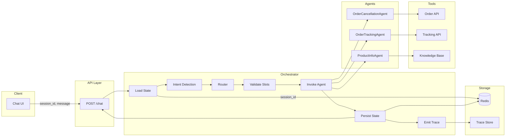

# Multi-Agent E-commerce Assistant

Production-ready conversational system for e-commerce customer service: order cancellation, order tracking, and product information. Built with a clear orchestrator–agent separation, session state, and turn-level observability.

---

## Architecture & Design Decisions

### Logical Architecture

- **Orchestrator** receives every `POST /chat` request, loads session state by `session_id`, runs intent detection, selects one agent, invokes it with validated inputs, persists state and trace, and returns the HTTP response. It does not interpret business rules (e.g. 24h cancellation); that is delegated to agents and tools.
- **Router / Intent detection** classifies user intent into: `cancel` (order cancellation), `track` (order tracking), `product` (product/FAQ), or `unclear`. The orchestrator uses this to pick the correct agent.
- **Agents** (stateless, no flow control):
  - **OrderCancellationAgent**: Validates order ID (ORD-XXXX), calls cancellation tool (which enforces 24h rule), returns structured result.
  - **OrderTrackingAgent**: Validates order ID, calls tracking tool, returns status and estimated delivery.
  - **ProductInfoAgent**: Queries knowledge base (JSON or RAG), returns answers. Used for FAQs and product-specific queries.
- **Tools**: Mock order API (cancellation with 24h rule), tracking API, and knowledge base. All business rules live in tools or agents; orchestrator only routes and persists.
- **Session state and trace** flow through a single pipeline: request → load state → intent → agent → tools → persist state + emit trace → response.

### Physical Architecture

- **API service**: Single stateless process (e.g. FastAPI). Handles `POST /chat` and any read-only session APIs. No in-process conversation storage.
- **Redis**: Session and conversation store keyed by `session_id`. Enables stateless API pods and session recovery.
- **Trace store**: Abstraction for turn-level observability (e.g. in-memory, Redis, or log stream). Stored separately from conversation state; no PII in traces if desired.
- **UI** (optional): Separate frontend for chat, session browser, and trace inspector; communicates with API only.

### Agent Responsibilities and Boundaries

| Component | Responsibility | Boundary |
|-----------|----------------|----------|
| **Orchestrator** | Load/save state, intent detection, agent selection, slot validation (e.g. order_id present?), call agent, build response, emit trace | Does not interpret business rules; does not decide cancellation eligibility |
| **OrderCancellationAgent** | Validate ORD-XXXX, call cancellation tool, return structured message + tool_calls | No flow control; fails loudly on invalid input |
| **OrderTrackingAgent** | Validate ORD-XXXX, call tracking tool, return status/delivery | No flow control |
| **ProductInfoAgent** | Query knowledge base, return answer | No flow control |

### Orchestrator Control Flow

1. Receive request → load session state by `session_id` (create empty if new).
2. Append user message to conversation.
3. **Intent detection**: cancel / track / product / unclear.
4. **Select agent** from intent (unclear → clarification or fallback agent).
5. **Validate required slots** (e.g. order_id for cancel/track). If missing, respond with clarification, persist slot state (e.g. "awaiting order_id"), and return; do not call agent.
6. **Resolve references** (e.g. "cancel the order for that" → resolve "that" from last extracted entity).
7. **Invoke agent** with validated inputs.
8. **Persist** agent response and tool_calls to session state.
9. **Build HTTP response**: `response`, `agent`, `tool_calls`, `handover`.
10. **Emit trace** (request_id, session_id, turn_index, intent, agent, tool_calls summary, latency, errors).

### State Model (Session, Entities, Context)

- **Session**: Keyed by `session_id`. Holds:
  - **Conversation history**: List of turns (user message, selected agent, tool_calls, assistant message, handover).
  - **Extracted entities**: Last mentioned order_id, product, etc., for multi-turn resolution (e.g. "that" → last order_id).
  - **Slot state** (optional): E.g. "awaiting order_id" so the next turn can collect it.
- **Turn**: One user message + one assistant response (agent name, tool_calls, response text, handover string).
- **Multi-turn context**: Example — Turn 1: "Can I return my Bluetooth headphones?" → ProductInfoAgent answers; entities may store product "Bluetooth headphones". Turn 2: "Cancel the order for that" → orchestrator resolves "that" to last order_id or product-related order from context, then routes to OrderCancellationAgent.

See [schemas/conversation_state.json](schemas/conversation_state.json) for the structured schema.

### Trace Model (Turn-Level Observability)

- **One trace event per turn**. Fields: `request_id`, `session_id`, `turn_index`, `timestamp` (ISO8601), `intent`, `selected_agent`, `tool_calls` (tool name, input, result summary), `latency_ms`, `errors`. No PII or full message content in trace by default; trace store is separate from conversation state.
- Used for debugging, latency and error monitoring, and audit. Every `POST /chat` emits a trace.

See [schemas/trace_event.json](schemas/trace_event.json) for the structured schema.

### Architecture Diagram



---

## API

- **POST /chat**  
  - Request: `{ "session_id": "string", "message": "string" }`  
  - Response: `{ "response": "string", "agent": "string", "tool_calls": [...], "handover": "string" }`  
  - See challenge spec and OpenAPI (when available) for full payloads.

- **Session APIs** (read-only): To be added (e.g. get session state for debug).

---

## Schemas

Structured contracts used by the orchestrator and agents (no free-text-only outputs):

| Schema | Purpose |
|--------|---------|
| [schemas/agent_response.json](schemas/agent_response.json) | Agent output: message, success/error, optional slots to fill |
| [schemas/tool_call.json](schemas/tool_call.json) | Tool invocation: tool name, input, result (aligns with challenge example) |
| [schemas/trace_event.json](schemas/trace_event.json) | Turn-level observability event |
| [schemas/conversation_state.json](schemas/conversation_state.json) | Session state: turns, extracted_entities, slot_state |

Validation rules (order ID format, 24h rule, timestamps): [schemas/validation_rules.md](schemas/validation_rules.md).

---

## Run Instructions

- **Local**: From repo root, install dependencies (`pip install -r requirements.txt`), then run the API:
  ```bash
  PYTHONPATH=. uvicorn src.main:app --reload
  ```
  Use `POST /chat` with body `{ "session_id": "<id>", "message": "<text>" }`. Session state is in-memory (M3 will add Redis). Orchestrator (M2) handles intent detection, routing, slot validation, and stub agent responses.
- **Docker**: `docker-compose up` to run API + Redis (+ UI if present). See Dockerfile and docker-compose.yml in later milestones (M9).

---

## License and Submission

See [challenge.md](challenge.md) for evaluation criteria and submission instructions.
